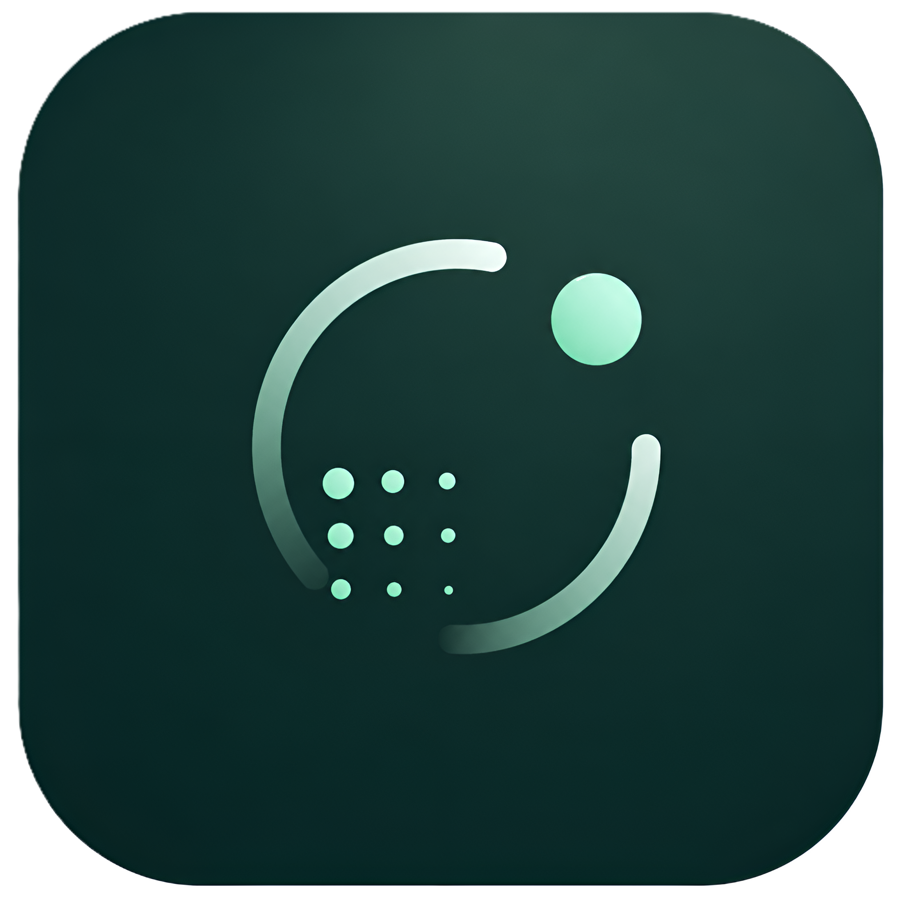

<div align="center">



# CCUS Suitability Analysis

### Onshore CO₂ Geological Storage Site Selection — Oslo Region, Norway

A desktop application for evaluating onshore locations for **Carbon Capture, Utilization and Storage (CCUS)**, combining Norwegian Geological Survey (NGU) bedrock data, structural geology, and lab-measured petrophysics into an interactive multi-criteria suitability analysis.

<br/>


-41CD52?logo=qt&logoColor=white)


<sub>Developed at <b>NGI</b> (Norwegian Geotechnical Institute)</sub>

</div>

---

## Overview

This program ranks onshore bedrock units near Oslo by their potential to host geological CO₂ storage. It takes raw NGU geodata as input and produces an interactive, multi-tab analysis: ranked suitability tables, 2D web maps, an interactive 3D terrain model draped with geology, and analysis plots — all from a single desktop window, no GIS expertise required.

The scoring follows two industry-standard multi-criteria decision methods:

- **WLC** — *Weighted Linear Combination*: you set the criterion weights manually.
- **AHP** — *Analytic Hierarchy Process*: weights are derived from a pairwise comparison matrix.

> **Scope note:** Seal / cap-rock evaluation is intentionally **out of scope** for this tool by project decision; the pipeline scores reservoir potential, fault proximity, structural dip, and petrophysics only.

---

## Key Features

| | Feature |
|---|---|
| 🗺️ | **2D interactive maps** — Folium / Leaflet maps of bedrock units, faults, and suitability scores, embedded directly in the app |
| ⛰️ | **3D terrain viewer** — PyVista + VTK DEM rendered with the geology draped on top, adjustable vertical exaggeration |
| 📊 | **Suitability ranking** — sortable summary table of rock families, CCUS role, area, and estimated CO₂ capacity |
| 🧮 | **Two scoring models** — WLC (manual weights) and AHP (pairwise-comparison weights) |
| 🪨 | **Petrophysics integration** — NGU lab measurements (porosity, density, thermal conductivity, magnetic susceptibility) |
| 📐 | **Structural geology** — distance-to-fault analysis (optimal zone 0.2–2 km) and dip-based trapping geometry |
| 🌍 | **Bilingual UI** — English & Norwegian (Norsk) |
| 🎨 | **Dark / light themes** |
| 📦 | **Standalone Windows build** — ships as a double-click `.exe`, no Python install required for end users |

---

## CO₂ Storage Capacity Estimation

For each candidate reservoir unit the app estimates storage capacity using the standard volumetric relation:

```
V = A · h · φ · E · ρ_CO₂
```

| Symbol | Meaning |
|--------|---------|
| `A`    | reservoir area |
| `h`    | effective thickness |
| `φ`    | porosity (lab-measured or fracture porosity input) |
| `E`    | storage efficiency factor |
| `ρ_CO₂`| density of CO₂ at storage conditions |

---

## Screenshots

> _Add a few screenshots here to give your program leader an instant feel for the app._
> _Drop PNGs into a `docs/` folder and reference them, e.g.:_
>
> ```markdown
> 
> 
> ```

---

## Getting Started

### Option A — Run from source (developers)

**Requirements:** Windows, Python 3.11+, and the data files (see [Data](#data)).

```powershell
# 1. Clone the repository
git clone <your-repo-url>
cd BerggrunnN250.gdb-20260313T123919Z-1-001

# 2. Create and activate a virtual environment
python -m venv .venv
.\.venv\Scripts\Activate.ps1

# 3. Install dependencies
pip install -r requirements.txt

# 4. Place the data files (see the Data section below), then launch
python main.py
```

### Option B — Run the packaged app (end users)

No Python needed. Build the distributable once (see [Building a Windows executable](#building-a-windows-executable)), then:

1. Open the `dist/CCUSApp/` folder.
2. Double-click **`CCUSApp.exe`**.

The whole `dist/CCUSApp/` folder is self-contained — zip it and share it as-is.

---

## Data

The large geodata is **not stored in this repository** (kept local to keep the repo lightweight). To run the app, place the following under a `data/` folder in the project root:

```
data/
├── BerggrunnN250.gdb/          # NGU bedrock map (BerggrunnN250)
│   ├── Linearstruktur_N250     # fault lineaments
│   └── StrukturMalepkt_N250    # structural measurement points (strike & dip)
├── Petrofysikk.csv             # NGU lab petrophysical properties
└── dem_*.tif                   # DEM tiles for the 3D viewer
```

**Source:** [NGU — Geological Survey of Norway](https://www.ngu.no/). The app expects the standard NGU `BerggrunnN250` schema (e.g. `hovedbergart_navn` bedrock-name field).

---

## Building a Windows Executable

The app bundles into a portable folder via PyInstaller:

```powershell
# From the project root, with the venv active:
powershell -ExecutionPolicy Bypass -File build_exe.ps1
```

This produces `dist/CCUSApp/CCUSApp.exe` and copies `assets/`, `data/`, and `output/figures/` alongside it (visible at the top level, not buried in `_internal/`). Ship the entire `dist/CCUSApp/` folder.

---

## Project Structure

```
.
├── main.py                  # Application entry point (splash → main window)
├── Views/                   # PySide6 UI layer
│   ├── main_window.py       # Main window: tabs, maps, 3D, tables, controls
│   ├── splash.py            # Branded splash screen
│   ├── settings_dialog.py   # Language / theme / analysis settings
│   ├── theme_manager.py     # Dark & light theme palettes
│   └── translator.py        # English / Norwegian strings
├── models/                  # Analysis & visualization logic
│   ├── ccus_analysis.py     # Suitability pipeline, scoring (WLC/AHP), capacity
│   └── dem_3d_viewer.py     # 3D DEM + geology drape (PyVista/VTK)
├── assets/                  # Logos and icons
├── requirements.txt         # Python dependencies
├── CCUSApp.spec             # PyInstaller build spec
├── build_exe.ps1            # One-command Windows build script
└── BerggrunnN250_v2_fixed.ipynb   # Canonical analysis notebook (reference)
```

---

## Tech Stack

**GUI:** PySide6 (Qt 6), QtWebEngine · **Geospatial:** GeoPandas, Shapely, pyogrio, rasterio, pyproj · **3D:** PyVista, VTK · **Maps:** Folium / Leaflet · **Data & plots:** pandas, NumPy, Matplotlib, Seaborn · **Packaging:** PyInstaller

---

## Acknowledgements

- **Data:** [NGU — Geological Survey of Norway](https://www.ngu.no/)
- **Developed at:** NGI (Norwegian Geotechnical Institute)

---

<div align="center">
<sub>© NGI · CCUS Suitability Analysis · For internal research use.</sub>
</div>
